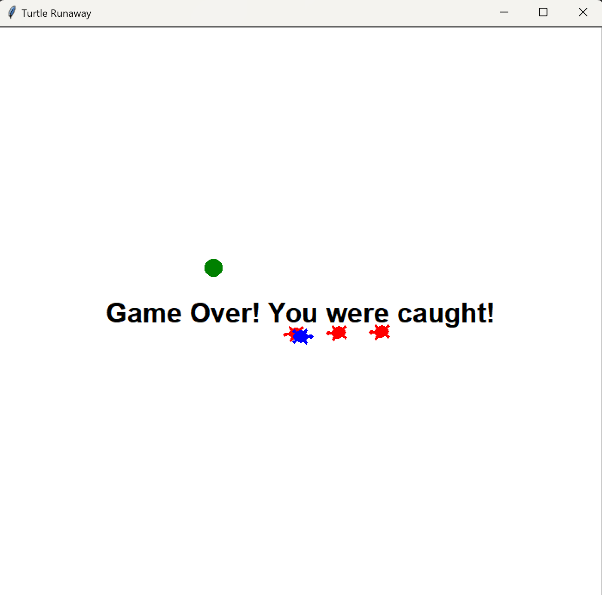

# Turtle Runaway Game

## Overview
The **Turtle Runaway Game** is a simple game where the player controls a blue turtle (the runner) that must avoid being caught by the red turtles (chasers). The player can also collect green circles (items) to increase their score. The goal is to reach a score of 50 points within 60 seconds. If the runner is caught by a chaser or fails to reach 50 points in 60 seconds, the game is over.

## Features
- **Player Control**: The player controls the runner (blue turtle) using the arrow keys.
- **Chasers**: Three red turtles chase the runner. The player must avoid them.
- **Items**: The player can collect green circles for points. Each item gives 10 points.
- **Timer**: The game has a 60-second timer.
- **Game Over Conditions**:
  - If the runner is caught by a chaser, the game ends with a "Game Over" message.
  - If the player fails to reach 50 points within 60 seconds, the game ends with a "Game Over" message.
  - If the player reaches 50 points within 60 seconds, the game ends with a congratulatory message.

## Controls
- **Up Arrow**: Move forward
- **Down Arrow**: Move backward
- **Left Arrow**: Turn left
- **Right Arrow**: Turn right

## Winning and Losing
- The player wins if they reach 50 points within the 60-second time limit.
  
  

- The player loses if they are caught by a chaser.
  
  

- The player loses if they fail to reach 50 points in 60 seconds.
  
  

## How It Works
- The player's score increases by 10 points every time they collect a green circle.
- The chasers are programmed to follow the runner, and the game checks whether a chaser catches the runner.
- The timer is displayed at the top left corner of the screen. If it reaches 60 seconds without the player scoring 50 points, the game ends.
- Game Over messages are displayed in the center of the screen.

## Code Structure
### Classes
1. **RunawayGame**: Manages the game logic, including score tracking, item creation, timer, and game over conditions.
2. **ManualMover**: Handles player-controlled movement of the runner.
3. **Chaser**: Controls the movement of the chasers, which follow the runner.

### Main Logic
The game starts by initializing the `RunawayGame` with the runner (controlled by the player) and multiple chasers. The game progresses in steps, continuously updating the positions of the runner and chasers while checking for collisions and item collection.

Enjoy the game and try to reach 50 points before time runs out!

